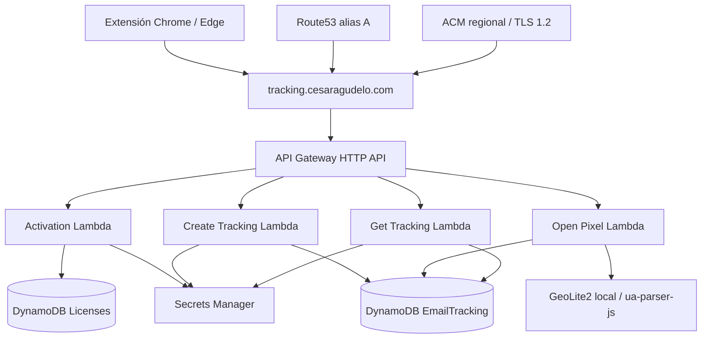

# Email Tracker

MVP de una extensión para **Google Chrome y Microsoft Edge**, compatible con
**Gmail Web y Outlook Web**. Permite activar una licencia, habilitar **Track email**
en un compose e insertar un pixel único antes de enviar. El popup muestra correos
rastreados y el historial de aperturas detectadas, con fecha, IP observada,
User-Agent, ubicación aproximada, navegador, sistema operativo y dispositivo
cuando pueden determinarse. No guarda el cuerpo ni adjuntos.

**“Open detected” NO significa necesariamente que una persona leyó el correo.**

## MVP Status

**Implemented locally:** Gmail, Outlook, activación, tracking, popup, geo/device,
infraestructura de dominio HTTPS y CLI administrativo create/list/revoke/installations.

**Pending production validation:** AWS deploy, DNS, ACM real, GeoLite2 real y
validación manual del flujo completo en producción. No hay AWS desplegado ni
producción validada como parte del cierre. Los tests automáticos son únicamente
unitarios; no hay tests E2E. Este cierre no añade funcionalidades posteriores al MVP.

## Arquitectura



| Ruta                             | Acceso y resultado                                                                                         |
| -------------------------------- | ---------------------------------------------------------------------------------------------------------- |
| `POST /api/activate`             | Público, valida código/licencia/cupos; entrega JWT tras registrar instalación.                             |
| `POST /api/tracking`             | JWT verificado en Lambda; crea UUID y devuelve `trackingUrl`.                                              |
| `GET /api/tracking/{trackingId}` | JWT y pertenencia a la licencia; devuelve historial y agregados derivados.                                 |
| `GET /o/{trackingId}`            | Público; UUID válido y tracking existente; almacena un OPEN independiente y devuelve PNG transparente 1×1. |

El dominio definitivo es `https://tracking.cesaragudelo.com`. La URL del pixel es
`https://tracking.cesaragudelo.com/o/{trackingId}`. API y pixel comparten mapping
raíz al stage `$default`; no hay CloudFront ni stages adicionales.
El endpoint execute-api queda habilitado para diagnóstico inicial, no como URL
pública del producto. La autorización continúa dentro de las Lambdas.

## Features MVP y providers

- Activación por código, installationId persistente y límite de dispositivos.
- Track email inicialmente OFF e independiente por compose; creación backend antes
  del envío, inserción del pixel y prevención de controles/envíos duplicados.
- Cada OPEN es un evento separado. `openCount`, `firstOpenedAt` y `lastOpenedAt`
  se calculan desde el historial, no desde un contador almacenado como única verdad.
- Enriquecimiento tolerante a fallos: sin geo/UA disponible se conserva el OPEN.
- Popup con los 100 tracking recientes guardados localmente, detalle y Refresh manual.
- Administración por CLI, sin editar DynamoDB manualmente ni dashboard.

Hosts: `mail.google.com`, `outlook.office.com`, `outlook.live.com` y
`outlook.office365.com`, todos HTTPS. Los adapters y selectores son independientes;
comparten controles, envío, pixel, API y almacenamiento. Solo se utiliza el primer
To válido; no hay tracking individual de múltiples destinatarios.

Si la creación, metadata o inserción falla, el envío nativo puede continuar sin
tracking. Un registro CREATED no demuestra que el correo se envió. Respuestas
inline sin metadata accesible, variantes del DOM, idiomas y shortcuts requieren
validación manual. No se soportan Outlook desktop, Gmail/Outlook móvil, Firefox,
Safari, envíos programados ni integraciones nativas.
Ver [detalles de la extensión](apps/extension/README.md).

## Dev setup, build y tests

Node.js **24**, npm **11**, TypeScript strict. Desde la raíz:

```sh
npm ci
npm run build
npm run lint
npm test
npm run format:check
npm run synth --workspace=@email-tracker/cdk -- --no-lookups
ENABLE_CUSTOM_DOMAIN=true npm run synth --workspace=@email-tracker/cdk -- --no-lookups
```

Build compila shared, genera `apps/extension/dist`, empaqueta las cuatro Lambdas
con esbuild en `services/tracking-api/build/lambda` y compila CDK. No requiere
credenciales. Si el entorno tiene pocos recursos, usar `npm test -- --maxWorkers=2`.
Vitest usa mocks de AWS/fetch/storage, firma JWT real con claves de prueba, jsdom
para adapters y assertions CDK. No se contacta AWS ni se ejecutan tests E2E.

Los synth generan CloudFormation localmente, con dominio OFF/ON respectivamente.
El dominio usa importación Route53 por atributos, sin lookups. Sin ID se genera
el parámetro obligatorio `HostedZoneId`, sin inventar valores.

| Carpeta                 | Responsabilidad                                                         |
| ----------------------- | ----------------------------------------------------------------------- |
| `apps/extension`        | Manifest V3, Vite, HTML/CSS/TS, adapters y popup; sin React.            |
| `services/tracking-api` | Handlers, servicios, repositorios, JWT, pixel y CLI.                    |
| `packages/shared`       | Contratos Zod y tipos comunes.                                          |
| `infrastructure/cdk`    | Dos tablas, cuatro Lambdas, HTTP API, secreto, logs y dominio opcional. |
| `docs`                  | Runbook, smoke checklist y troubleshooting.                             |

## Configuración

| Variable / opción                                             | Uso                                                                                                                                                    |
| ------------------------------------------------------------- | ------------------------------------------------------------------------------------------------------------------------------------------------------ |
| `VITE_ACTIVATION_API_URL`                                     | `.env.production` de extensión: `https://tracking.cesaragudelo.com`. Es la variable real; no usar `VITE_API_BASE_URL`.                                 |
| `.env.production.local`                                       | Override local opcional de Vite; no versionar; recompilar y recargar.                                                                                  |
| `build:development`                                           | `npm run build:development --workspace=@email-tracker/extension`; usa `http://localhost:3000`. No incluye un servidor backend local.                   |
| `ENABLE_CUSTOM_DOMAIN`                                        | `true` habilita dominio; omitido/`false` lo desactiva.                                                                                                 |
| `HOSTED_ZONE_ID`                                              | Zona pública existente `cesaragudelo.com`, en la misma cuenta. Formato `Z…`, sin `/hostedzone/`. Requiere dominio ON.                                  |
| `TRACKING_BASE_URL`                                           | CDK inyecta la base sin `/o`; default dominio definitivo. Con dominio OFF admite override local; ON exige la URL definitiva. Normaliza barras finales. |
| `jwtTtlSeconds`                                               | Contexto CDK, 1–86400 segundos; default 86400.                                                                                                         |
| `GEOLITE2_CITY_DB_PATH`                                       | Ruta privada a MMDB al compilar. Lambda usa `/var/task/GeoLite2-City.mmdb`.                                                                            |
| `LICENSE_TABLE_NAME`, `TRACKING_TABLE_NAME`, `JWT_SECRET_ARN` | Inyectados por CDK; ARN del secreto, nunca valor.                                                                                                      |
| `--table`, `--region`                                         | Configuración administrativa CLI. SDK usa la cadena predeterminada de credenciales, sin cuenta/región/profile hardcodeados.                            |

CDK lee variables del proceso, no carga `.env` automáticamente. Cuenta y región
se resuelven con el entorno/perfil seleccionado para deployment. La extensión
genera `host_permissions` solo para el origen API configurado. CORS y CSP no se
amplían: las llamadas HTTP salen del service worker, mediante mensajería desde
popup/content scripts.

## Admin CLI

Compilar antes de usar. Los ejemplos AWS son para **después del deployment
explícitamente autorizado**; no se ejecutan durante este milestone.

```sh
# Local: crea una propuesta nueva sin almacenarla ni contactar AWS.
npm run license:create -- --max-devices 2
# Real: código nuevo; no es el mismo que el dry-run anterior.
npm run license:create -- --max-devices 2 --table TABLE_NAME --region REGION --write
# Lecturas reales cuando exista AWS:
npm run license:list -- --table TABLE_NAME --region REGION
npm run license:installations -- --license-id LICENSE_ID --table TABLE_NAME --region REGION
# Dry-run local, no comprueba existencia:
npm run license:revoke -- --license-id LICENSE_ID --table TABLE_NAME
# Escritura explícita e idempotente:
npm run license:revoke -- --license-id LICENSE_ID --table TABLE_NAME --region REGION --write
```

Sustituir `TABLE_NAME` por el output `LicenseTableName`, `REGION` por la región
real y `LICENSE_ID` por `lic_<UUID>` generado. `--region` es opcional si ya está
configurada. Create admite `--expires-at` con fecha futura, por ejemplo ISO UTC.
Se conserva el comando create anterior, sin subcomando obligatorio.

- **Create:** genera 192 bits aleatorios, muestra el código una sola vez y solo
  persiste su SHA-256. Crea lookup/licencia atómicamente, `ACTIVE`, `maxDevices`,
  `activeDevices=0`, `createdAt`. Sin `--write` no contacta AWS. No redirigir su
  salida a logs/archivos; entregar el código por un canal privado. No hay recuperación
  del código desde su hash. Un fallo de escritura no muestra el código.
- **List:** imprime un JSON por licencia con licenseId, status, maxDevices,
  activeDevices, createdAt y expiresAt si existe. Usa **Scan administrativo**
  paginado (100 elementos evaluados por petición); sigue incluso páginas filtradas
  vacías. La tabla no tiene una partición global ni GSI de licencias. Scan lee
  también lookup/instalaciones; el filtro/proyección no reduce la capacidad leída.
  Para un MVP pequeño es aceptable bajo demanda; no ejecutarlo periódicamente ni
  asumir orden o snapshot consistente durante cambios concurrentes. No se concede
  Scan a Lambdas ni a la extensión.
- **Revoke:** sin `--write` describe el cambio sin llamadas AWS. Con flag hace un
  Update condicionado a existencia y cambia únicamente `status=REVOKED`; conserva
  historial, hash, lookup, contadores e instalaciones. Repetir devuelve REVOKED.
  Una licencia inexistente produce error, nunca se crea accidentalmente.
- **Installations:** verifica existencia con GetItem consistente y usa Query
  paginado dentro de `LICENSE#<id>`. Muestra installationId, activatedAt, lastSeenAt
  y status almacenado. Una instalación puede seguir diciendo ACTIVE aunque su
  licencia esté REVOKED: el estado efectivo depende de la licencia. No libera cupos.

List/installations/revoke no muestran hashes, códigos ni JWT. Las listas terminan
con `Complete: N ...`; si hay error tras una página, la salida previa es parcial y
el proceso termina con código 1, sin mensaje Complete. Errores distinguen argumentos,
licencia/tabla ausente, autenticación AWS, permisos y red, sin stack traces ni detalles
sensibles. Tras timeout de una escritura, comprobar list antes de asumir que no ocurrió;
revoke puede repetirse. No se ofrece retry automático de create que genere otra licencia.

Permisos del **administrador**, solo sobre la tabla de licencias: create necesita
`dynamodb:PutItem` (los dos Put transaccionales); list `dynamodb:Scan`; revoke
`dynamodb:UpdateItem`; installations `dynamodb:GetItem` y `dynamodb:Query`.
No requiere leer Secrets Manager. El CLI no crea permisos ni usa credenciales en la extensión.

## Datos y seguridad

| Tabla / registro       | PK                      | SK                           |
| ---------------------- | ----------------------- | ---------------------------- |
| Licencias: lookup      | `CODE#<sha256>`         | `LOOKUP`                     |
| Licencias: licencia    | `LICENSE#<licenseId>`   | `LICENSE`                    |
| Licencias: instalación | `LICENSE#<licenseId>`   | `INSTALLATION#<uuid>`        |
| Tracking: correo       | `TRACKING#<trackingId>` | `EMAIL`                      |
| Tracking: apertura     | `TRACKING#<trackingId>` | `OPEN#<timestamp>#<eventId>` |

Activation usa lecturas consistentes y transacciones condicionadas a licencia activa,
expiración y cupos; reactivación actualiza lastSeenAt sin consumir otro cupo.
No hay TTL de borrado de licencias ni liberación automática de dispositivos.
Fechas descriptivas ISO UTC; expiresAt e iat/exp en segundos epoch.

JWT HS256 con issuer/audience y claims licenseId, installationId, iat y exp.
Firma verificada en cada API protegida; consulta restringida a la licencia propietaria.
Secrets Manager genera y custodia la clave; roles Lambda con permisos específicos.
Duración máxima/default 24 horas, limitada por expiresAt de licencia. El worker guarda
el JWT en `chrome.storage.local` restringido a contextos confiables; el popup solo
recibe estado y los content scripts no reciben tokens. El UUID no es una prueba
criptográfica del dispositivo; reinstalar puede consumir otro cupo.

**Revocar bloquea nuevas activaciones y reactivaciones, pero no invalida JWT ya
emitidos:** POST/GET tracking no consultan estado de licencia y pueden autorizarlos
hasta `exp`. El popup puede seguir Activated. No hay blacklist distribuida ni
renovación automática. Revoke no bloquea el pixel público de correos anteriores.

Los logs estructurados no guardan código, JWT, secreto, cuerpo, destinatario ni
User-Agent/IP raw; esos últimos pueden estar en eventos DynamoDB, no en logs.
No se almacenan contraseñas, cookies ni tokens de Gmail/Outlook, cuerpo ni adjuntos.
No subir `.env` con secretos, MMDB, capturas de Authorization ni salidas create a Git.
Tablas, secreto y logs se retienen al retirar el stack; logs con retención de un mes.
No hay borrado automático de eventos ni herramientas de exportación/borrado en este MVP.

## Privacy y limitaciones

Gmail image proxy, Apple Mail Privacy Protection, caché, proxies corporativos,
VPN, bloqueo de imágenes, antivirus/security scanners y prefetching alteran las
solicitudes del pixel. Incluso cargar el pixel en el compose del remitente puede
registrar OPEN. **openCount puede ser mayor o menor que las aperturas humanas**;
múltiples aperturas pueden no producir nuevas requests. IP, ubicación, navegador,
OS y dispositivo pueden pertenecer al proxy, no al destinatario. Ubicación es
aproximada y no identifica a una persona; no hay detección automática de proxies.

GeoLite2 es opcional; sin MMDB válida o con IP no localizable, se muestra ubicación
no disponible. UA desconocido produce Unknown. Eventos históricos sin esos campos
siguen siendo consultables con valores desconocidos. La DB no se descarga ni se
actualiza automáticamente. Este producto utiliza datos GeoLite2 creados por MaxMind,
disponibles en [MaxMind](https://www.maxmind.com); revisar los términos de su cuenta
antes de incorporar/distribuir la DB. No versionar binarios ni claves de MaxMind.

DynamoDB conserva todos los eventos. El historial reciente del popup contiene
solo los últimos 100 tracking creados en esa instalación; se pierde al borrar
storage/desinstalar, no sincroniza dispositivos ni recupera creaciones anteriores.
El detalle se consulta con selección/Refresh, sin polling. No hay paginación del
historial de eventos en la API MVP; grandes historiales pueden exceder límites de
respuesta. No hay notificaciones, analytics, link/attachment tracking, campañas,
billing, SaaS dashboard, equipos, SSO ni aplicaciones móviles.

## Deployment, smoke testing y troubleshooting

- [Runbook de deployment y operación](docs/operations.md): orden completo desde
  AWS CLI y cuenta/región hasta dominio, licencia, observabilidad y revocación.
- [Checklist reusable de smoke testing](docs/smoke-test.md): ejecutar manualmente
  en Chrome/Edge con Gmail/Outlook, registrar resultados y evidencias sin secretos.
- [Troubleshooting](docs/troubleshooting.md): causas probables y diagnóstico.

Para una revisión local sin AWS, inspeccionar `dist/manifest.json`, cargar
`apps/extension/dist` en Chrome/Edge y comprobar detección de compose, Track OFF y
fallback si el backend está ausente. No demuestra activación ni seguimiento real.
El runbook y checklist completos quedan pendientes; ninguna operación AWS, DNS,
certificado real o envío real se realizó como parte del Milestone 15.
